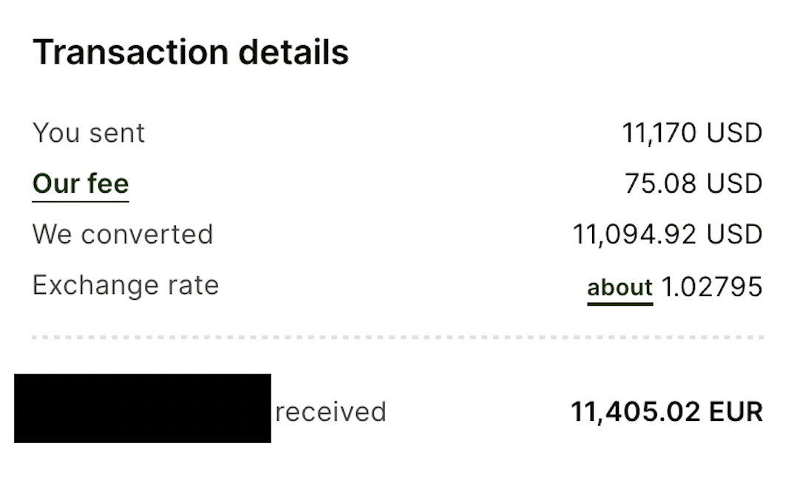

# Banking {#chapter-banking}

## International Money Transfers

Most of you will be moving from countries that do not use the Euro as its currency, but, as noted in the [Funding chapter](#chapter-funding), you will need to convert your local currency to obtain at least €11208 for your [Sperrkonto](#banking-sperrkonto), and you will likely need €1000-2000 more for your initial living expenses after relocating including registration fees, housing, food, etc.

Virtually all banks will be able to process requests for international transfers via wire or similar methods. However, such transfers are generally quite expensive; an explicit international wire transfer fee may be applied, and, more importantly, the exchange rates offered by your bank might cost you dozens to hundreds of extra euros. Rather than relying on your bank to initiate transfers from your local currency to euros, I recommend using a third-party service.

### Third-Party Services

These services should be fairly easy to find by searching for "cheap international wire transfer" or similar keywords, but **[I personally recommend using Wise](https://wise.com/invite/dic/patrickc2551)**. They had the cheapest available transfer services at the time I signed up, their website is quite simple to use, and it offers useful features such as comparing their [exchanges rates to their competitors](https://wise.com/us/blog/alternatives-to-wise). Their main competitor appears to be a company called MoneyGram, but Wise otherwise own or provide services to many "competing" money transfer services.

Note: the [referral link](https://wise.com/invite/dic/patrickc2551) I've included states that new sign-ups receive "A fee-free transfer up to $600 when they sign up" with the link. I find this wording ambiguous as it might be indicating that this discount only applies to US-based customers. In any case, it *should* reduce your transfer fee by a few Euros.

#### Wise Example

The actual exchange rate information for the date I initiated the transfer is [available here](https://www.exchangerates.org.uk/USD-EUR-15_10_2022-exchange-rate-history.html). The best exchange rate for that day was $1 USD = 1.0287 Euro$ on the open market, but currency exchange providers always alter the price a bit such that they can earn a profit and/or hedge against price fluctuations. 

The exchange rate Wise offered for my transfer on that day was $1 USD = 1.02795 Euro$ meaning they took a maximum margin of $(1.0287 - 1.02795)\frac{Euro}{USD} = 0.00075\frac{Euro}{USD}$ or about \$8.32USD on the ~\$11,100USD I converted to Euros. Additionally, Wise charged a $75.08 flat fee for the transfer bringing the **total transfer cost to around \$85**. 

(\#fig:unnamed-chunk-1)Actual transfer details including fee

In contrast, at the time of writing, my US bank offered an exchange rate of $1 USD = 0.8934 Euro$ while the open market rate stands at $1 USD = 0.92153 Euro$ indicating a margin of $0.02813\frac{Euro}{USD}$ which would cost \$312.24USD on the same \$11,100.

**TL;DR I saved >$200 by transferring with Wise rather than my bank.**

## Sperrkonto {#banking-sperrkonto}

- must fund a Sperrkonto ("blocked account") to the federal minimum amount which is €11208/year in 2023. This amount generally increases a few hundred Euros every year
- There's more competition amongst Sperrkonto providers than amongst the wire transfer companies in my opinion, and the primary providers are listed below:
  <!-- - [Coracle]() -->
  - Coracle
  - Expatrio
  - Fintiba
  - Sparkasse (don't know much about this option)
  
A comparison of the first three is available at the [Simple Germany website](https://www.simplegermany.com/best-blocked-account-germany/). The table they provide is convenient although I would say it's overkill becuase it is highly unlikely you will go through your Sperrkonto provider for the insurance or regular checking account options (and I would recommend against this). The only components of concern are the costs and whether they are approved by the German Foreign Office. Regarding cost, the table is out-of-date at the time of writing this so I've provided a quick comparison of the first three options below assuming a one-year student visa

* Coracle: initial fee of €99, for a total of €99 for the first year. Subsequent years are a flat €60/year.
* Expatrio: initial fee of €49 and a monthly fee of €5/month for a total of €109 for the first year.
* Fintiba: initial fee of €89 and a monthly fee of €4.90/month for a total of €147.8 for the first year.

## Checking Accounts

You may have heard that Germany is still incredibly reliant on cash, and that credit/debit cards are not accepted many places. There is still some truth to this, but you typically won't have a problem using a debit card in the cities and surrounding neighborhoods.

### Options

- [N26](https://n26.com/r/patrickc4192) offers a quick and easy sign-up that can be done completely online. Note that you will need to complete a video call with their identify verification service provider, and this needs to be done in a private, quiet location. Have your passport ready. Can transfer money user-to-user and via IBAN
- Revolut is quite popular, and offers similar user-to-user transfers and bank (IBAN) transfers
- ...

### EC Cards?

## Euro Transfers

- PayPal
- Your banking app (e.g. N26, Revolut, etc.) via IBAN number

